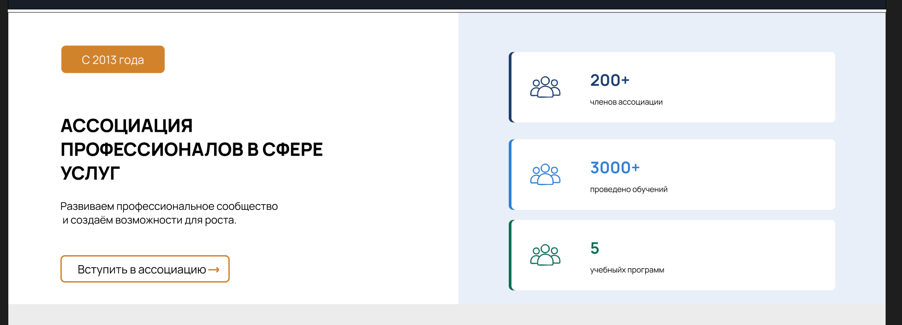
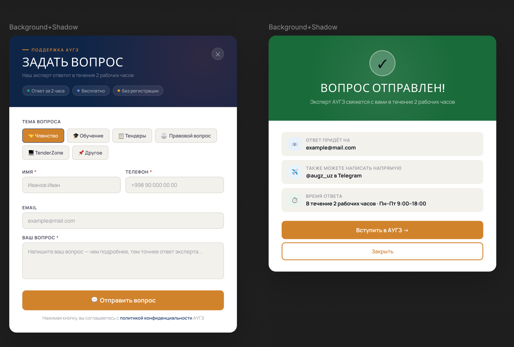
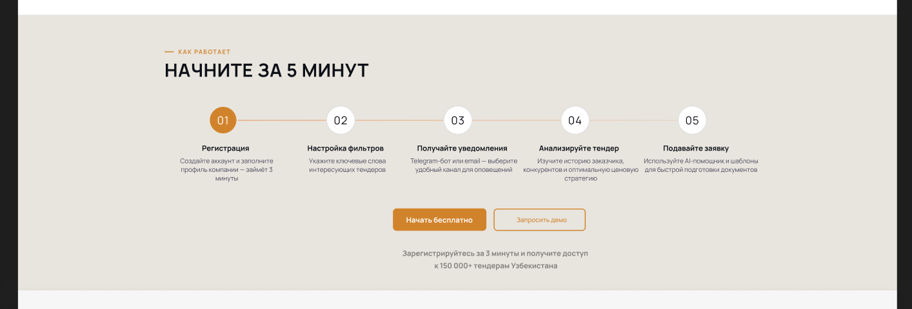

1. Первый. В главной странице, если нажать на лидеров, то должно открываться один диалог с подробной информацией о лидере. Эта информация будет редактироваться через админку. Там будут имя лидера, имя, фамилия, его должность и немного подробностей про него. На всякий случай надо будет добавить ещё соцсетей. С соцсетями мы укажем, допустим, статику. Мы не будем спрашивать конкретно про какие соцсети типа Телеграма, Инстаграма и так далее. Они сами будут писать лейбл типа Телеграм равен к ссылке, а вот Инстаграм пишет лейбл и напишут свою ссылку через админку.
2. Удалить все данные, касающиеся в блок "Наши направления" в главной странице (admin, back)
3. Убрать блок контакты с главной страницы
4.  Сделать этот блок в о нас и работать с его админкой и бэк, но этот блок должен подходить нам по теме (цветы и т.д)
5. Добавить пагинацию в страницу с новостями, также добавить поиск для удобного поиска
6. Убрать блок с отзывами в /membership
7. Убрать всё что связано с тарифами в /membership (admin, front, back)
8.  сделать эту модалку для кнопки задать вопрос в /membership 
9.  Надо реализовать эту часть в тендер зоне. Страница будет иметь две кнопки: "Начать бесплатно" и "Запросить демо". Там будет какая-то надпись "Зарегистрируйтесь на 3 минуты" или что-то такое.
Надо будет реализовать один компонент, который отправляет в админку форму. На других страницах тоже есть такие формочки, они тоже отправляют все запросы в нашу админку. Надо будет реализовать универсальный компонент, который может использоваться во всех страницах. Админка должна все-таки принимать эти формочки, но при отправке должны быть указаны с какой страницы была отправлена эта форма. \
10. Сменить кнопку Связаться с нами в навбар на Подать жалобу который перенаправляет на /report